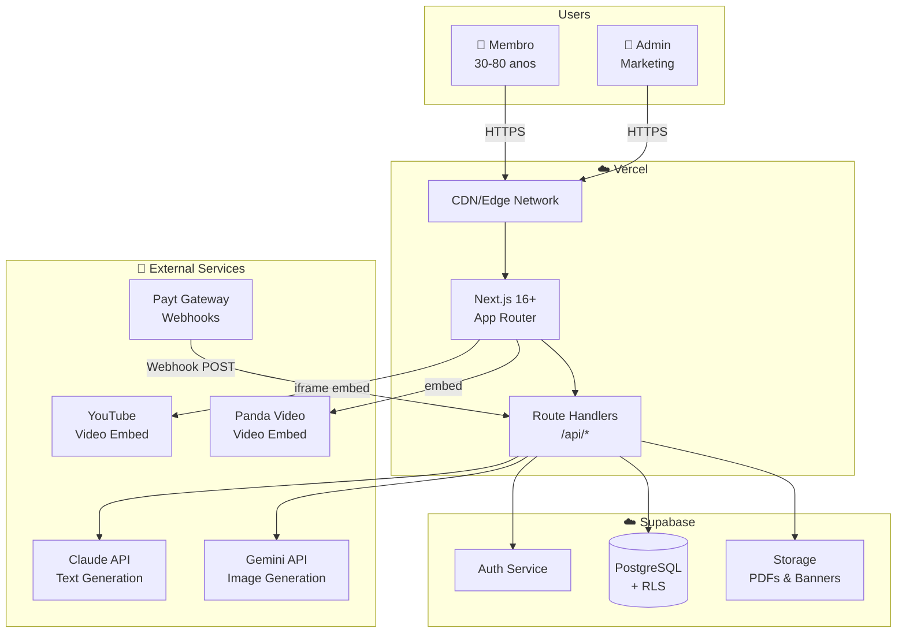
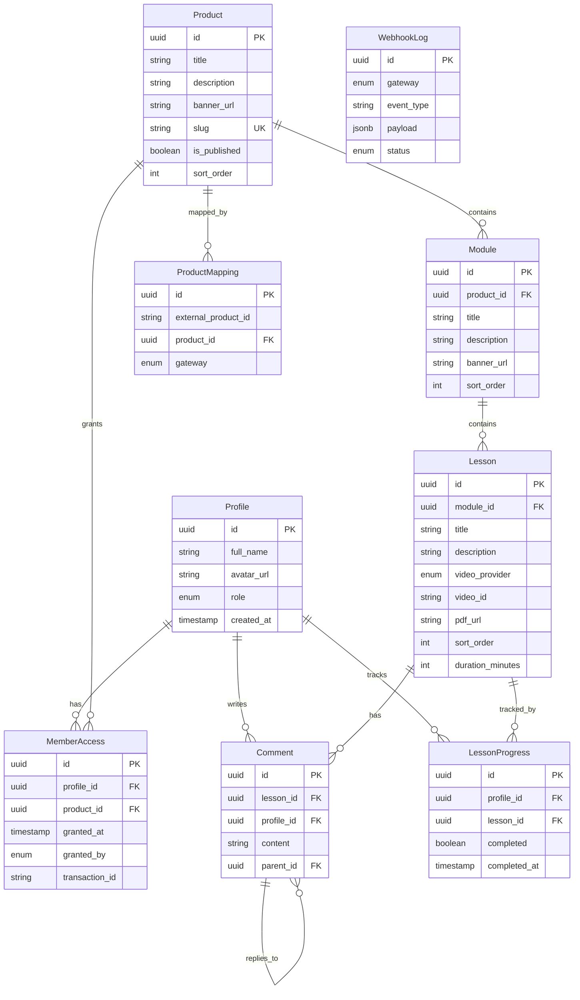
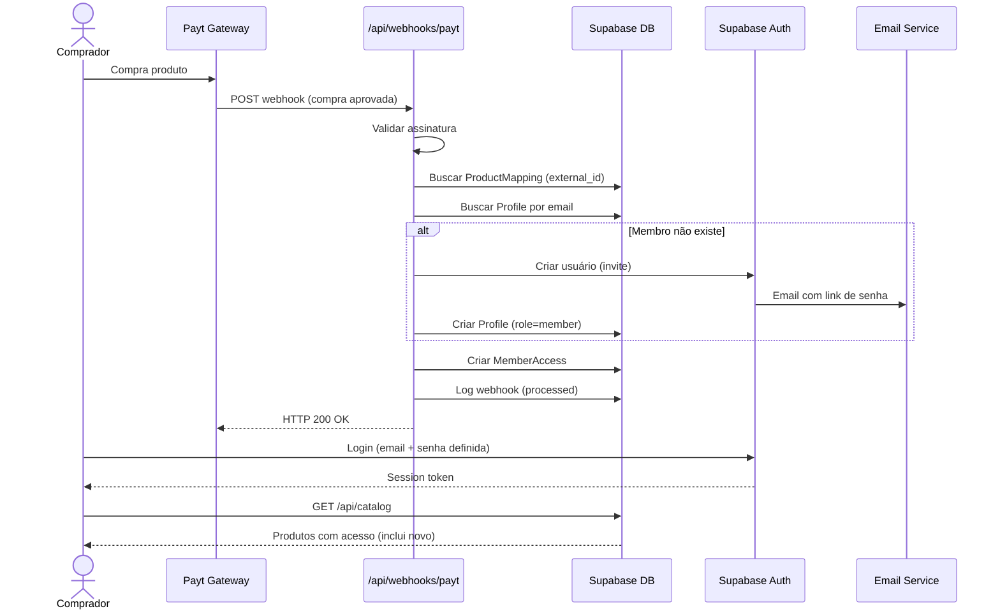
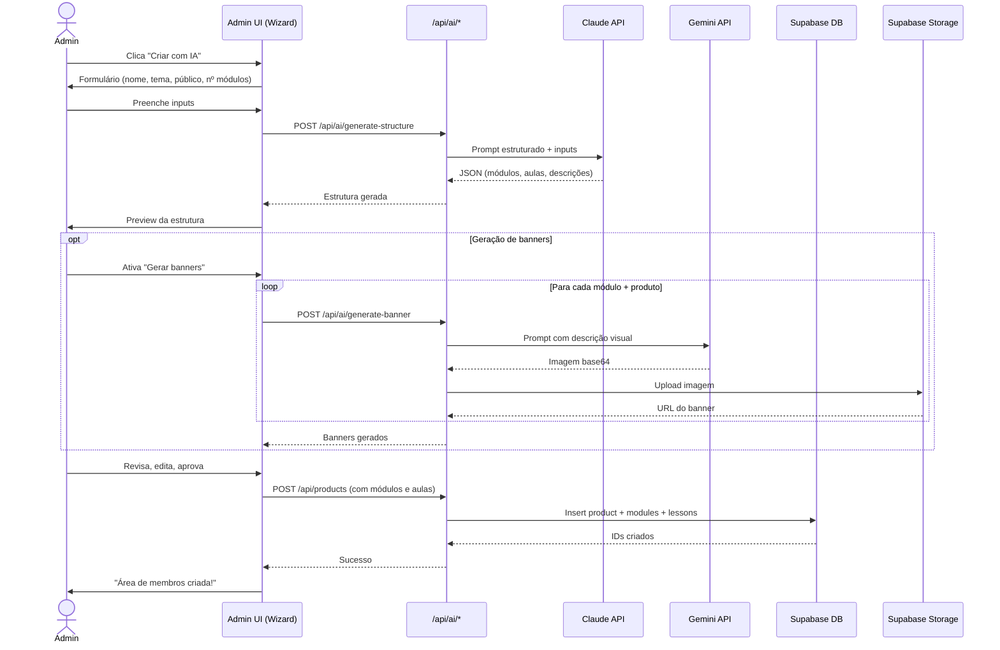
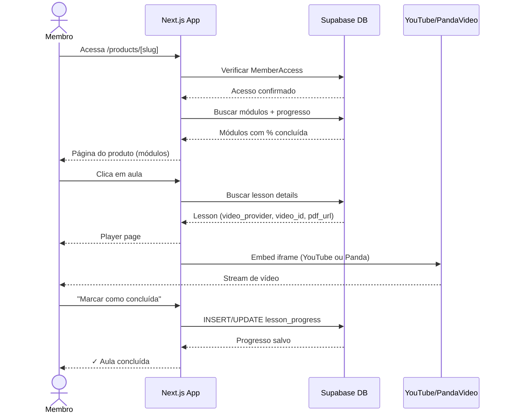
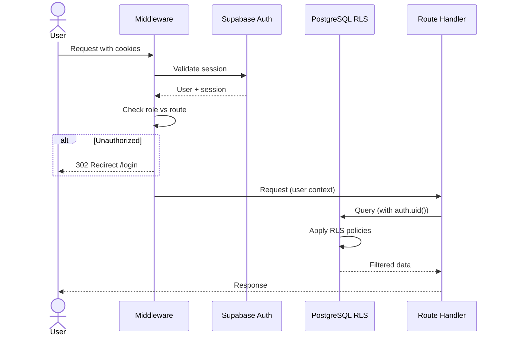
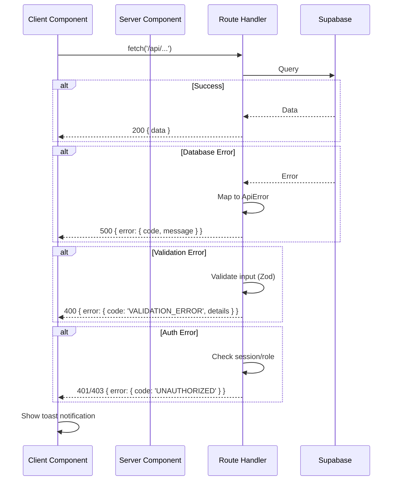

# Memberly Fullstack Architecture Document

> **Versão:** 1.0
> **Data:** 2026-03-11
> **Autor:** Aria (Architect Agent)
> **Status:** Draft
> **Baseado em:** [PRD v1.0](./prd.md), [Brief v1.0](./brief.md)

---

## 1. Introduction

Este documento define a arquitetura fullstack completa do **Memberly** — plataforma interna de criação e gestão de áreas de membros estilo Netflix para a The Scalers. Serve como fonte da verdade para o desenvolvimento AI-driven, cobrindo backend, frontend, infraestrutura e integrações em um documento unificado.

### Starter Template

**N/A — Greenfield project.** O projeto será criado do zero usando Next.js 16+ com App Router, sem templates de terceiros. A estrutura seguirá o padrão AIOX monorepo com `packages/`.

### Change Log

| Date | Version | Description | Author |
|------|---------|-------------|--------|
| 2026-03-11 | 1.0 | Arquitetura inicial completa | Aria (Architect) |

---

## 2. High Level Architecture

### Technical Summary

O Memberly adota uma **arquitetura serverless fullstack** usando Next.js 16+ como camada unificada de frontend e API, com Supabase como backend-as-a-service (PostgreSQL, Auth, Storage). O frontend usa React Server Components por padrão, com Client Components para interatividade. A comunicação entre frontend e backend ocorre via Next.js Route Handlers (REST-like), eliminando a necessidade de um backend separado. A infraestrutura é totalmente gerenciada: Vercel para compute/CDN e Supabase para dados/auth/storage. Duas APIs externas complementam o sistema: Claude API (Anthropic) para geração textual de estrutura de cursos e Gemini API (Google) para geração de banners visuais.

### Platform and Infrastructure

**Platform:** Vercel + Supabase

**Key Services:**
- **Vercel:** Hosting Next.js (Edge Runtime + Node.js Runtime), CDN global, preview deployments, analytics
- **Supabase:** PostgreSQL database, Auth (email/senha), Storage (PDFs, banners), Realtime (futuro), Row Level Security
- **Claude API:** Geração de estrutura textual (módulos, aulas, descrições)
- **Gemini API:** Geração de imagens de banners

**Deployment Regions:**
- Vercel: São Paulo (GRU) — edge functions distribuídas globalmente
- Supabase: São Paulo (sa-east-1) — proximidade com usuários brasileiros

### Repository Structure

**Structure:** Monorepo (npm workspaces)
**Monorepo Tool:** npm workspaces nativo (sem Turborepo/Nx — overhead desnecessário para 1 app)
**Package Organization:** Single app package no MVP, expansível para shared packages futuramente

### High Level Architecture Diagram



### Architectural Patterns

- **Serverless Fullstack:** Next.js unifica frontend e API em um único deployment, eliminando complexidade de orquestração de serviços — _Rationale:_ Equipe de 1 pessoa, menor overhead operacional possível
- **React Server Components (RSC):** Componentes renderizados no servidor por padrão, Client Components apenas para interatividade — _Rationale:_ Melhor performance de carregamento inicial, crucial para público 30-80 anos em conexões variáveis
- **BaaS (Backend-as-a-Service):** Supabase gerencia DB, Auth e Storage, eliminando necessidade de backend custom — _Rationale:_ Reduz código boilerplate e manutenção de infraestrutura
- **Row Level Security (RLS):** Policies no PostgreSQL garantem isolamento de dados no nível do banco — _Rationale:_ Segurança defense-in-depth, membros só acessam dados autorizados mesmo que o código da aplicação tenha bugs
- **Repository Pattern:** Camada de abstração sobre o Supabase client para acesso a dados — _Rationale:_ Facilita testes e eventual migração futura
- **Feature-based Organization:** Código organizado por feature (products, members, lessons) em vez de tipo (controllers, services) — _Rationale:_ Facilita navegação e encapsulamento para desenvolvimento AI-driven

---

## 3. Tech Stack

| Category | Technology | Version | Purpose | Rationale |
|----------|-----------|---------|---------|-----------|
| Language | TypeScript | 5.x | Tipagem estática fullstack | Type safety, DX, compartilhamento de tipos |
| Frontend Framework | Next.js | 16+ | App Router, RSC, API Routes | Fullstack unificado, Vercel-native |
| UI Library | React | 19+ | Componentes UI | Bundled com Next.js 16+ |
| CSS Framework | Tailwind CSS | 4.x | Styling utility-first | Produtividade, design system flexível |
| State Management | Zustand | 5.x | Client-side state | Simples, sem boilerplate, TypeScript-first |
| Database | PostgreSQL (Supabase) | 15+ | Dados relacionais + RLS | Supabase-managed, RLS nativo, free tier |
| Auth | Supabase Auth | latest | Email/senha, sessions | Zero config, integrado com RLS |
| File Storage | Supabase Storage | latest | PDFs, banners | Integrado, signed URLs, policies |
| AI (Texto) | Claude API | latest | Geração de estrutura | Qualidade superior em texto estruturado |
| AI (Imagens) | Gemini API | latest | Geração de banners | Geração de imagens nativa |
| Testing (Unit) | Vitest | 3.x | Unit + integration tests | Mais rápido que Jest, compatível com Vite |
| Testing (Components) | React Testing Library | 16.x | Testes de componentes | Testing-library pattern, acessibilidade |
| Linting | ESLint | 9.x | Code quality | Flat config, Next.js plugin |
| Formatting | Prettier | 3.x | Code formatting | Consistência automática |
| Deployment | Vercel | - | Hosting, CDN, CI/CD | Next.js-native, zero config deploy |
| Monitoring | Vercel Analytics | - | Web Vitals, usage | Built-in, zero config |

---

## 4. Data Models

### Profile

**Purpose:** Extensão do auth.users do Supabase com dados adicionais do membro/admin.

```typescript
interface Profile {
  id: string;              // UUID, matches auth.users.id
  full_name: string;
  avatar_url: string | null;
  role: 'member' | 'admin';
  created_at: string;      // ISO 8601
  updated_at: string;
}
```

**Relationships:**
- Has many `MemberAccess` (1:N)
- Has many `Comment` (1:N)
- Has many `LessonProgress` (1:N)

---

### Product

**Purpose:** Curso, mentoria ou programa vendido pela The Scalers.

```typescript
interface Product {
  id: string;              // UUID
  title: string;
  description: string;
  banner_url: string | null;
  slug: string;            // URL-friendly, unique
  is_published: boolean;
  sort_order: number;
  created_at: string;
  updated_at: string;
}
```

**Relationships:**
- Has many `Module` (1:N)
- Has many `MemberAccess` (1:N)
- Has many `ProductMapping` (1:N)

---

### Module

**Purpose:** Seção/capítulo dentro de um produto (ex: "Módulo 1: Fundamentos").

```typescript
interface Module {
  id: string;              // UUID
  product_id: string;      // FK → Product
  title: string;
  description: string;
  banner_url: string | null;
  sort_order: number;
  created_at: string;
}
```

**Relationships:**
- Belongs to `Product` (N:1)
- Has many `Lesson` (1:N)

---

### Lesson

**Purpose:** Aula individual com vídeo e/ou material PDF.

```typescript
interface Lesson {
  id: string;              // UUID
  module_id: string;       // FK → Module
  title: string;
  description: string;
  video_provider: 'youtube' | 'pandavideo';
  video_id: string;        // YouTube video ID or Panda Video ID
  pdf_url: string | null;  // Supabase Storage URL
  sort_order: number;
  duration_minutes: number | null;
  created_at: string;
}
```

**Relationships:**
- Belongs to `Module` (N:1)
- Has many `Comment` (1:N)
- Has many `LessonProgress` (1:N)

---

### MemberAccess

**Purpose:** Controle de acesso — qual membro tem acesso a qual produto.

```typescript
interface MemberAccess {
  id: string;              // UUID
  profile_id: string;      // FK → Profile
  product_id: string;      // FK → Product
  granted_at: string;      // ISO 8601
  granted_by: 'webhook' | 'manual';
  transaction_id: string | null;  // ID da transação na Payt
}
```

**Relationships:**
- Belongs to `Profile` (N:1)
- Belongs to `Product` (N:1)

---

### ProductMapping

**Purpose:** Mapeia IDs de produtos externos (Payt) para produtos internos do Memberly.

```typescript
interface ProductMapping {
  id: string;              // UUID
  external_product_id: string;   // ID do produto na Payt
  product_id: string;      // FK → Product
  gateway: 'payt';
  created_at: string;
}
```

**Relationships:**
- Belongs to `Product` (N:1)

---

### Comment

**Purpose:** Comentários de membros nas aulas.

```typescript
interface Comment {
  id: string;              // UUID
  lesson_id: string;       // FK → Lesson
  profile_id: string;      // FK → Profile
  content: string;         // Max 2000 chars
  parent_id: string | null; // FK → Comment (self-ref for replies)
  created_at: string;
}
```

**Relationships:**
- Belongs to `Lesson` (N:1)
- Belongs to `Profile` (N:1)
- Has many `Comment` as replies (self-referential 1:N)

---

### LessonProgress

**Purpose:** Tracking de progresso do membro por aula.

```typescript
interface LessonProgress {
  id: string;              // UUID
  profile_id: string;      // FK → Profile
  lesson_id: string;       // FK → Lesson
  completed: boolean;
  completed_at: string | null;
}
```

**Relationships:**
- Belongs to `Profile` (N:1)
- Belongs to `Lesson` (N:1)

---

### WebhookLog

**Purpose:** Registro de todos os webhooks recebidos para auditoria.

```typescript
interface WebhookLog {
  id: string;              // UUID
  gateway: 'payt';
  event_type: string;
  payload: Record<string, any>;  // JSON completo
  status: 'processed' | 'failed' | 'ignored';
  error_message: string | null;
  created_at: string;
}
```

### Entity Relationship Diagram



---

## 5. API Specification

A API usa **Next.js Route Handlers** (REST-like). Todas as rotas ficam em `src/app/api/`.

### Authentication

Todas as rotas (exceto webhook e auth) requerem session válida via Supabase Auth. A role é verificada via profile.role.

### Endpoints

#### Auth
| Method | Route | Auth | Description |
|--------|-------|------|-------------|
| POST | `/api/auth/signup` | Public | Registro (admin-initiated) |
| POST | `/api/auth/login` | Public | Login email/senha |
| POST | `/api/auth/logout` | Member | Logout |
| POST | `/api/auth/forgot-password` | Public | Recuperação de senha |

#### Products (Admin)
| Method | Route | Auth | Description |
|--------|-------|------|-------------|
| GET | `/api/products` | Admin | Listar todos os produtos |
| POST | `/api/products` | Admin | Criar produto |
| GET | `/api/products/[id]` | Admin | Detalhes do produto |
| PATCH | `/api/products/[id]` | Admin | Atualizar produto |
| DELETE | `/api/products/[id]` | Admin | Excluir produto |
| PATCH | `/api/products/[id]/publish` | Admin | Toggle publicação |
| PATCH | `/api/products/reorder` | Admin | Reordenar produtos |

#### Modules (Admin)
| Method | Route | Auth | Description |
|--------|-------|------|-------------|
| GET | `/api/products/[id]/modules` | Admin | Listar módulos do produto |
| POST | `/api/products/[id]/modules` | Admin | Criar módulo |
| PATCH | `/api/modules/[id]` | Admin | Atualizar módulo |
| DELETE | `/api/modules/[id]` | Admin | Excluir módulo |
| PATCH | `/api/products/[id]/modules/reorder` | Admin | Reordenar módulos |

#### Lessons (Admin)
| Method | Route | Auth | Description |
|--------|-------|------|-------------|
| GET | `/api/modules/[id]/lessons` | Admin | Listar aulas do módulo |
| POST | `/api/modules/[id]/lessons` | Admin | Criar aula |
| PATCH | `/api/lessons/[id]` | Admin | Atualizar aula |
| DELETE | `/api/lessons/[id]` | Admin | Excluir aula |
| PATCH | `/api/modules/[id]/lessons/reorder` | Admin | Reordenar aulas |

#### Members (Admin)
| Method | Route | Auth | Description |
|--------|-------|------|-------------|
| GET | `/api/members` | Admin | Listar membros (paginado, busca, filtro) |
| GET | `/api/members/[id]` | Admin | Detalhes do membro + acessos |
| POST | `/api/members/[id]/access` | Admin | Atribuir acesso manual |
| DELETE | `/api/members/[id]/access/[productId]` | Admin | Remover acesso |

#### Member Area (Member)
| Method | Route | Auth | Description |
|--------|-------|------|-------------|
| GET | `/api/catalog` | Member | Produtos do membro com progresso |
| GET | `/api/catalog/[slug]` | Member | Produto com módulos + progresso |
| GET | `/api/catalog/[slug]/lessons/[lessonId]` | Member | Aula com detalhes |
| POST | `/api/progress/[lessonId]` | Member | Marcar aula como concluída |
| GET | `/api/lessons/[id]/comments` | Member | Listar comentários da aula |
| POST | `/api/lessons/[id]/comments` | Member | Criar comentário |

#### AI Generation (Admin)
| Method | Route | Auth | Description |
|--------|-------|------|-------------|
| POST | `/api/ai/generate-structure` | Admin | Gerar estrutura via Claude API |
| POST | `/api/ai/generate-banner` | Admin | Gerar banner via Gemini API |

#### Webhooks
| Method | Route | Auth | Description |
|--------|-------|------|-------------|
| POST | `/api/webhooks/payt` | Signature | Receber webhook da Payt |

### Error Response Format

```typescript
interface ApiError {
  error: {
    code: string;          // e.g., 'UNAUTHORIZED', 'NOT_FOUND', 'VALIDATION_ERROR'
    message: string;       // Human-readable message
    details?: Record<string, any>;
  };
}
```

### Standard HTTP Status Codes

| Code | Usage |
|------|-------|
| 200 | Success |
| 201 | Created |
| 400 | Validation error |
| 401 | Unauthenticated |
| 403 | Forbidden (wrong role) |
| 404 | Not found |
| 409 | Conflict (duplicate) |
| 500 | Internal server error |

---

## 6. External APIs

### Claude API (Anthropic)

- **Purpose:** Geração de estrutura textual de áreas de membros (módulos, aulas, títulos, descrições)
- **Documentation:** https://docs.anthropic.com/
- **Base URL:** `https://api.anthropic.com/v1`
- **Authentication:** API Key via header `x-api-key`
- **Rate Limits:** Depende do tier; free tier: 5 RPM, 20K tokens/min

**Key Endpoints Used:**
- `POST /messages` — Enviar prompt estruturado e receber JSON com estrutura de curso

**Integration Notes:** Usar `@anthropic-ai/sdk` (Anthropic SDK). O prompt deve instruir output em JSON com schema definido. Timeout de 30s. Retry com backoff exponencial em caso de rate limit (429).

### Gemini API (Google)

- **Purpose:** Geração de imagens de banners para produtos e módulos
- **Documentation:** https://ai.google.dev/docs
- **Base URL:** `https://generativelanguage.googleapis.com/v1beta`
- **Authentication:** API Key via query param ou header
- **Rate Limits:** Depende do tier; free tier: 15 RPM

**Key Endpoints Used:**
- `POST /models/gemini-2.0-flash-exp:generateContent` — Gerar imagens a partir de descrição textual

**Integration Notes:** Usar `@google/generative-ai` SDK. Imagens retornadas em base64, converter para blob e upload para Supabase Storage. Prompt deve especificar dimensões (16:9 para banners) e estilo visual.

### Payt (Gateway de Pagamento)

- **Purpose:** Receber notificações de compra via webhook para liberar acesso
- **Documentation:** A ser confirmada com stakeholder
- **Authentication:** Validação de assinatura/token no header do webhook
- **Rate Limits:** N/A (incoming webhooks)

**Key Endpoints Used:**
- Incoming: `POST /api/webhooks/payt` — Receber evento de compra

**Integration Notes:** Webhook é incoming (Payt → Memberly). Validar assinatura antes de processar. Implementar idempotência via `transaction_id`. Logar todos os webhooks em `webhook_logs`.

---

## 7. Core Workflows

### Workflow 1: Compra → Acesso Automático



### Workflow 2: Admin Cria Área de Membros via IA



### Workflow 3: Membro Assiste Aula



---

## 8. Database Schema

```sql
-- ============================================
-- Memberly Database Schema
-- PostgreSQL (Supabase)
-- ============================================

-- Enable UUID extension
CREATE EXTENSION IF NOT EXISTS "uuid-ossp";

-- ============================================
-- PROFILES (extends auth.users)
-- ============================================
CREATE TABLE profiles (
    id UUID PRIMARY KEY REFERENCES auth.users(id) ON DELETE CASCADE,
    full_name TEXT NOT NULL DEFAULT '',
    avatar_url TEXT,
    role TEXT NOT NULL DEFAULT 'member' CHECK (role IN ('member', 'admin')),
    created_at TIMESTAMPTZ NOT NULL DEFAULT NOW(),
    updated_at TIMESTAMPTZ NOT NULL DEFAULT NOW()
);

-- Auto-create profile on auth.users insert
CREATE OR REPLACE FUNCTION handle_new_user()
RETURNS TRIGGER AS $$
BEGIN
    INSERT INTO public.profiles (id, full_name, role)
    VALUES (
        NEW.id,
        COALESCE(NEW.raw_user_meta_data->>'full_name', ''),
        COALESCE(NEW.raw_user_meta_data->>'role', 'member')
    );
    RETURN NEW;
END;
$$ LANGUAGE plpgsql SECURITY DEFINER;

CREATE TRIGGER on_auth_user_created
    AFTER INSERT ON auth.users
    FOR EACH ROW EXECUTE FUNCTION handle_new_user();

-- ============================================
-- PRODUCTS
-- ============================================
CREATE TABLE products (
    id UUID PRIMARY KEY DEFAULT uuid_generate_v4(),
    title TEXT NOT NULL,
    description TEXT NOT NULL DEFAULT '',
    banner_url TEXT,
    slug TEXT NOT NULL UNIQUE,
    is_published BOOLEAN NOT NULL DEFAULT false,
    sort_order INTEGER NOT NULL DEFAULT 0,
    created_at TIMESTAMPTZ NOT NULL DEFAULT NOW(),
    updated_at TIMESTAMPTZ NOT NULL DEFAULT NOW()
);

CREATE INDEX idx_products_slug ON products(slug);
CREATE INDEX idx_products_published ON products(is_published);

-- ============================================
-- MODULES
-- ============================================
CREATE TABLE modules (
    id UUID PRIMARY KEY DEFAULT uuid_generate_v4(),
    product_id UUID NOT NULL REFERENCES products(id) ON DELETE CASCADE,
    title TEXT NOT NULL,
    description TEXT NOT NULL DEFAULT '',
    banner_url TEXT,
    sort_order INTEGER NOT NULL DEFAULT 0,
    created_at TIMESTAMPTZ NOT NULL DEFAULT NOW()
);

CREATE INDEX idx_modules_product ON modules(product_id);

-- ============================================
-- LESSONS
-- ============================================
CREATE TABLE lessons (
    id UUID PRIMARY KEY DEFAULT uuid_generate_v4(),
    module_id UUID NOT NULL REFERENCES modules(id) ON DELETE CASCADE,
    title TEXT NOT NULL,
    description TEXT NOT NULL DEFAULT '',
    video_provider TEXT NOT NULL CHECK (video_provider IN ('youtube', 'pandavideo')),
    video_id TEXT NOT NULL DEFAULT '',
    pdf_url TEXT,
    sort_order INTEGER NOT NULL DEFAULT 0,
    duration_minutes INTEGER,
    created_at TIMESTAMPTZ NOT NULL DEFAULT NOW()
);

CREATE INDEX idx_lessons_module ON lessons(module_id);

-- ============================================
-- MEMBER ACCESS
-- ============================================
CREATE TABLE member_access (
    id UUID PRIMARY KEY DEFAULT uuid_generate_v4(),
    profile_id UUID NOT NULL REFERENCES profiles(id) ON DELETE CASCADE,
    product_id UUID NOT NULL REFERENCES products(id) ON DELETE CASCADE,
    granted_at TIMESTAMPTZ NOT NULL DEFAULT NOW(),
    granted_by TEXT NOT NULL DEFAULT 'manual' CHECK (granted_by IN ('webhook', 'manual')),
    transaction_id TEXT,
    UNIQUE(profile_id, product_id)
);

CREATE INDEX idx_member_access_profile ON member_access(profile_id);
CREATE INDEX idx_member_access_product ON member_access(product_id);
CREATE INDEX idx_member_access_transaction ON member_access(transaction_id);

-- ============================================
-- PRODUCT MAPPINGS (external gateway IDs)
-- ============================================
CREATE TABLE product_mappings (
    id UUID PRIMARY KEY DEFAULT uuid_generate_v4(),
    external_product_id TEXT NOT NULL,
    product_id UUID NOT NULL REFERENCES products(id) ON DELETE CASCADE,
    gateway TEXT NOT NULL DEFAULT 'payt' CHECK (gateway IN ('payt')),
    created_at TIMESTAMPTZ NOT NULL DEFAULT NOW(),
    UNIQUE(external_product_id, gateway)
);

CREATE INDEX idx_product_mappings_external ON product_mappings(external_product_id, gateway);

-- ============================================
-- COMMENTS
-- ============================================
CREATE TABLE comments (
    id UUID PRIMARY KEY DEFAULT uuid_generate_v4(),
    lesson_id UUID NOT NULL REFERENCES lessons(id) ON DELETE CASCADE,
    profile_id UUID NOT NULL REFERENCES profiles(id) ON DELETE CASCADE,
    content TEXT NOT NULL CHECK (char_length(content) <= 2000),
    parent_id UUID REFERENCES comments(id) ON DELETE CASCADE,
    created_at TIMESTAMPTZ NOT NULL DEFAULT NOW()
);

CREATE INDEX idx_comments_lesson ON comments(lesson_id);
CREATE INDEX idx_comments_parent ON comments(parent_id);

-- ============================================
-- LESSON PROGRESS
-- ============================================
CREATE TABLE lesson_progress (
    id UUID PRIMARY KEY DEFAULT uuid_generate_v4(),
    profile_id UUID NOT NULL REFERENCES profiles(id) ON DELETE CASCADE,
    lesson_id UUID NOT NULL REFERENCES lessons(id) ON DELETE CASCADE,
    completed BOOLEAN NOT NULL DEFAULT false,
    completed_at TIMESTAMPTZ,
    UNIQUE(profile_id, lesson_id)
);

CREATE INDEX idx_lesson_progress_profile ON lesson_progress(profile_id);

-- ============================================
-- WEBHOOK LOGS
-- ============================================
CREATE TABLE webhook_logs (
    id UUID PRIMARY KEY DEFAULT uuid_generate_v4(),
    gateway TEXT NOT NULL DEFAULT 'payt',
    event_type TEXT NOT NULL DEFAULT '',
    payload JSONB NOT NULL DEFAULT '{}',
    status TEXT NOT NULL DEFAULT 'processed' CHECK (status IN ('processed', 'failed', 'ignored')),
    error_message TEXT,
    created_at TIMESTAMPTZ NOT NULL DEFAULT NOW()
);

CREATE INDEX idx_webhook_logs_created ON webhook_logs(created_at DESC);

-- ============================================
-- ROW LEVEL SECURITY (RLS)
-- ============================================

-- Profiles: users can read their own profile, admins can read all
ALTER TABLE profiles ENABLE ROW LEVEL SECURITY;

CREATE POLICY "Users can view own profile"
    ON profiles FOR SELECT
    USING (auth.uid() = id);

CREATE POLICY "Users can update own profile"
    ON profiles FOR UPDATE
    USING (auth.uid() = id);

CREATE POLICY "Admins can view all profiles"
    ON profiles FOR SELECT
    USING (
        EXISTS (SELECT 1 FROM profiles WHERE id = auth.uid() AND role = 'admin')
    );

-- Products: members see published products they have access to, admins see all
ALTER TABLE products ENABLE ROW LEVEL SECURITY;

CREATE POLICY "Members can view accessible published products"
    ON products FOR SELECT
    USING (
        is_published = true
        AND EXISTS (
            SELECT 1 FROM member_access
            WHERE member_access.product_id = products.id
            AND member_access.profile_id = auth.uid()
        )
    );

CREATE POLICY "Admins have full access to products"
    ON products FOR ALL
    USING (
        EXISTS (SELECT 1 FROM profiles WHERE id = auth.uid() AND role = 'admin')
    );

-- Modules: accessible if product is accessible
ALTER TABLE modules ENABLE ROW LEVEL SECURITY;

CREATE POLICY "Members can view modules of accessible products"
    ON modules FOR SELECT
    USING (
        EXISTS (
            SELECT 1 FROM member_access
            WHERE member_access.product_id = modules.product_id
            AND member_access.profile_id = auth.uid()
        )
    );

CREATE POLICY "Admins have full access to modules"
    ON modules FOR ALL
    USING (
        EXISTS (SELECT 1 FROM profiles WHERE id = auth.uid() AND role = 'admin')
    );

-- Lessons: accessible if parent module's product is accessible
ALTER TABLE lessons ENABLE ROW LEVEL SECURITY;

CREATE POLICY "Members can view lessons of accessible products"
    ON lessons FOR SELECT
    USING (
        EXISTS (
            SELECT 1 FROM modules
            JOIN member_access ON member_access.product_id = modules.product_id
            WHERE modules.id = lessons.module_id
            AND member_access.profile_id = auth.uid()
        )
    );

CREATE POLICY "Admins have full access to lessons"
    ON lessons FOR ALL
    USING (
        EXISTS (SELECT 1 FROM profiles WHERE id = auth.uid() AND role = 'admin')
    );

-- Member Access: members see own access, admins see all
ALTER TABLE member_access ENABLE ROW LEVEL SECURITY;

CREATE POLICY "Members can view own access"
    ON member_access FOR SELECT
    USING (profile_id = auth.uid());

CREATE POLICY "Admins have full access to member_access"
    ON member_access FOR ALL
    USING (
        EXISTS (SELECT 1 FROM profiles WHERE id = auth.uid() AND role = 'admin')
    );

-- Comments: members can read comments on accessible lessons, write own
ALTER TABLE comments ENABLE ROW LEVEL SECURITY;

CREATE POLICY "Members can view comments on accessible lessons"
    ON comments FOR SELECT
    USING (
        EXISTS (
            SELECT 1 FROM lessons
            JOIN modules ON modules.id = lessons.module_id
            JOIN member_access ON member_access.product_id = modules.product_id
            WHERE lessons.id = comments.lesson_id
            AND member_access.profile_id = auth.uid()
        )
    );

CREATE POLICY "Members can create comments on accessible lessons"
    ON comments FOR INSERT
    WITH CHECK (
        profile_id = auth.uid()
        AND EXISTS (
            SELECT 1 FROM lessons
            JOIN modules ON modules.id = lessons.module_id
            JOIN member_access ON member_access.product_id = modules.product_id
            WHERE lessons.id = comments.lesson_id
            AND member_access.profile_id = auth.uid()
        )
    );

CREATE POLICY "Admins have full access to comments"
    ON comments FOR ALL
    USING (
        EXISTS (SELECT 1 FROM profiles WHERE id = auth.uid() AND role = 'admin')
    );

-- Lesson Progress: members manage own progress
ALTER TABLE lesson_progress ENABLE ROW LEVEL SECURITY;

CREATE POLICY "Members can manage own progress"
    ON lesson_progress FOR ALL
    USING (profile_id = auth.uid());

CREATE POLICY "Admins can view all progress"
    ON lesson_progress FOR SELECT
    USING (
        EXISTS (SELECT 1 FROM profiles WHERE id = auth.uid() AND role = 'admin')
    );

-- Product Mappings: admin only
ALTER TABLE product_mappings ENABLE ROW LEVEL SECURITY;

CREATE POLICY "Admins have full access to product_mappings"
    ON product_mappings FOR ALL
    USING (
        EXISTS (SELECT 1 FROM profiles WHERE id = auth.uid() AND role = 'admin')
    );

-- Webhook Logs: admin only
ALTER TABLE webhook_logs ENABLE ROW LEVEL SECURITY;

CREATE POLICY "Admins can view webhook_logs"
    ON webhook_logs FOR SELECT
    USING (
        EXISTS (SELECT 1 FROM profiles WHERE id = auth.uid() AND role = 'admin')
    );

-- Service role bypass for webhook processing
-- (webhooks use supabase service_role key, bypasses RLS)
```

---

## 9. Frontend Architecture

### Component Organization

```
src/
├── app/                          # Next.js App Router
│   ├── (auth)/                   # Auth group (public)
│   │   ├── login/page.tsx
│   │   ├── forgot-password/page.tsx
│   │   └── layout.tsx
│   ├── (member)/                 # Member area group
│   │   ├── page.tsx              # Home (catálogo Netflix)
│   │   ├── products/
│   │   │   └── [slug]/
│   │   │       ├── page.tsx      # Product (módulos)
│   │   │       └── lessons/
│   │   │           └── [lessonId]/
│   │   │               └── page.tsx  # Player + comments
│   │   └── layout.tsx            # Member layout (dark, Netflix)
│   ├── admin/                    # Admin area group
│   │   ├── page.tsx              # Dashboard
│   │   ├── products/
│   │   │   ├── page.tsx          # Product list
│   │   │   ├── new/page.tsx      # Create product
│   │   │   └── [id]/
│   │   │       ├── page.tsx      # Edit product
│   │   │       └── modules/
│   │   │           ├── page.tsx  # Module list
│   │   │           └── [moduleId]/
│   │   │               └── lessons/
│   │   │                   └── page.tsx  # Lesson list
│   │   ├── members/
│   │   │   ├── page.tsx          # Member list
│   │   │   └── [id]/page.tsx     # Member details
│   │   ├── ai/
│   │   │   └── generate/page.tsx # AI wizard
│   │   ├── settings/page.tsx     # Settings
│   │   └── layout.tsx            # Admin layout (light, sidebar)
│   ├── api/                      # Route Handlers
│   │   ├── auth/
│   │   ├── products/
│   │   ├── modules/
│   │   ├── lessons/
│   │   ├── members/
│   │   ├── catalog/
│   │   ├── progress/
│   │   ├── ai/
│   │   └── webhooks/
│   ├── layout.tsx                # Root layout
│   └── middleware.ts             # Auth + role routing
├── components/
│   ├── ui/                       # Base UI components (Button, Input, Card, Modal, etc.)
│   ├── admin/                    # Admin-specific components
│   ├── member/                   # Member-specific components (Carousel, HeroBanner, etc.)
│   └── shared/                   # Shared components (VideoPlayer, PdfViewer, Comments)
├── lib/
│   ├── supabase/
│   │   ├── client.ts             # Browser Supabase client
│   │   ├── server.ts             # Server Supabase client
│   │   └── middleware.ts         # Supabase middleware helper
│   ├── api/
│   │   ├── claude.ts             # Claude API client
│   │   └── gemini.ts             # Gemini API client
│   └── utils/
│       ├── cn.ts                 # className merge (clsx + twMerge)
│       └── format.ts             # Formatters (date, duration, etc.)
├── hooks/
│   ├── useAuth.ts                # Auth state hook
│   ├── useProducts.ts            # Products data hook
│   └── useProgress.ts            # Progress tracking hook
├── stores/
│   ├── auth-store.ts             # Auth state (Zustand)
│   └── ui-store.ts               # UI state (sidebar, modals)
└── types/
    ├── database.ts               # Supabase generated types
    └── api.ts                    # API request/response types
```

### State Management (Zustand)

```typescript
// stores/auth-store.ts
interface AuthState {
  user: Profile | null;
  isLoading: boolean;
  setUser: (user: Profile | null) => void;
}

// stores/ui-store.ts
interface UIState {
  sidebarOpen: boolean;
  toggleSidebar: () => void;
}
```

**State Management Patterns:**
- Server state (products, members, progress) via React Server Components + `fetch` — no client state needed
- Client state (UI toggles, form state) via Zustand — minimal, transient
- Auth state via Supabase Auth hooks (`onAuthStateChange`) synced to Zustand
- No global cache layer — RSC handles data fetching and caching

### Routing Architecture

```
Route Groups:
├── (auth)    → Public routes, auth layout (centered, minimal)
├── (member)  → Protected (role=member), Netflix layout (dark)
└── admin     → Protected (role=admin), admin layout (light, sidebar)
```

**Protected Route Pattern (middleware.ts):**

```typescript
import { createServerClient } from '@supabase/ssr';
import { NextResponse, type NextRequest } from 'next/server';

export async function middleware(request: NextRequest) {
  const supabase = createServerClient(/* config */);
  const { data: { user } } = await supabase.auth.getUser();

  const path = request.nextUrl.pathname;

  // Public routes
  if (path.startsWith('/login') || path.startsWith('/forgot-password') || path.startsWith('/api/webhooks')) {
    return NextResponse.next();
  }

  // Not authenticated → login
  if (!user) {
    return NextResponse.redirect(new URL('/login', request.url));
  }

  // Get role from profile
  const { data: profile } = await supabase
    .from('profiles')
    .select('role')
    .eq('id', user.id)
    .single();

  // Admin routes → require admin role
  if (path.startsWith('/admin') && profile?.role !== 'admin') {
    return NextResponse.redirect(new URL('/', request.url));
  }

  return NextResponse.next();
}

export const config = {
  matcher: ['/((?!_next/static|_next/image|favicon.ico).*)'],
};
```

### Frontend Services Layer

```typescript
// lib/supabase/client.ts
import { createBrowserClient } from '@supabase/ssr';

export function createClient() {
  return createBrowserClient(
    process.env.NEXT_PUBLIC_SUPABASE_URL!,
    process.env.NEXT_PUBLIC_SUPABASE_ANON_KEY!
  );
}

// lib/supabase/server.ts
import { createServerClient } from '@supabase/ssr';
import { cookies } from 'next/headers';

export async function createServerSupabaseClient() {
  const cookieStore = await cookies();
  return createServerClient(
    process.env.NEXT_PUBLIC_SUPABASE_URL!,
    process.env.NEXT_PUBLIC_SUPABASE_ANON_KEY!,
    { cookies: { getAll: () => cookieStore.getAll(), setAll: (c) => c.forEach(({ name, value, options }) => cookieStore.set(name, value, options)) } }
  );
}
```

---

## 10. Backend Architecture

### Service Architecture (Serverless — Next.js Route Handlers)

```
src/app/api/
├── auth/
│   ├── login/route.ts
│   ├── logout/route.ts
│   └── forgot-password/route.ts
├── products/
│   ├── route.ts                  # GET (list), POST (create)
│   ├── [id]/
│   │   ├── route.ts             # GET, PATCH, DELETE
│   │   ├── publish/route.ts     # PATCH (toggle)
│   │   └── modules/
│   │       ├── route.ts         # GET (list), POST (create)
│   │       └── reorder/route.ts # PATCH
│   └── reorder/route.ts         # PATCH
├── modules/
│   ├── [id]/
│   │   ├── route.ts             # PATCH, DELETE
│   │   └── lessons/
│   │       ├── route.ts         # GET, POST
│   │       └── reorder/route.ts # PATCH
├── lessons/
│   └── [id]/
│       ├── route.ts             # PATCH, DELETE
│       └── comments/
│           └── route.ts         # GET, POST
├── members/
│   ├── route.ts                 # GET (list with search/filter)
│   └── [id]/
│       ├── route.ts             # GET (details)
│       └── access/
│           ├── route.ts         # POST (grant)
│           └── [productId]/route.ts  # DELETE (revoke)
├── catalog/
│   ├── route.ts                 # GET (member's products + progress)
│   └── [slug]/
│       ├── route.ts             # GET (product detail + modules)
│       └── lessons/
│           └── [lessonId]/route.ts  # GET (lesson detail)
├── progress/
│   └── [lessonId]/route.ts      # POST (mark complete)
├── ai/
│   ├── generate-structure/route.ts  # POST (Claude API)
│   └── generate-banner/route.ts     # POST (Gemini API)
└── webhooks/
    └── payt/route.ts            # POST (incoming webhook)
```

### Route Handler Template

```typescript
// Example: src/app/api/products/route.ts
import { createServerSupabaseClient } from '@/lib/supabase/server';
import { NextResponse, type NextRequest } from 'next/server';

export async function GET() {
  const supabase = await createServerSupabaseClient();

  const { data, error } = await supabase
    .from('products')
    .select('*, modules(count)')
    .order('sort_order');

  if (error) {
    return NextResponse.json(
      { error: { code: 'FETCH_ERROR', message: error.message } },
      { status: 500 }
    );
  }

  return NextResponse.json(data);
}

export async function POST(request: NextRequest) {
  const supabase = await createServerSupabaseClient();
  const body = await request.json();

  // Validation
  if (!body.title) {
    return NextResponse.json(
      { error: { code: 'VALIDATION_ERROR', message: 'Title is required' } },
      { status: 400 }
    );
  }

  const { data, error } = await supabase
    .from('products')
    .insert({ ...body })
    .select()
    .single();

  if (error) {
    return NextResponse.json(
      { error: { code: 'CREATE_ERROR', message: error.message } },
      { status: error.code === '23505' ? 409 : 500 }
    );
  }

  return NextResponse.json(data, { status: 201 });
}
```

### Authentication & Authorization



**Auth Middleware Pattern:**
- Middleware validates session on every request (except public routes and webhooks)
- Supabase RLS provides second layer of protection at database level
- Webhook routes use signature validation instead of session auth
- Admin routes check `profile.role === 'admin'` in middleware

---

## 11. Unified Project Structure

```
memberly/
├── .github/                      # CI/CD (future)
│   └── workflows/
│       └── ci.yaml
├── docs/                         # Documentation
│   ├── brief.md                  # Project brief
│   ├── prd.md                    # Product requirements
│   ├── architecture.md           # This document
│   ├── architecture/             # ADRs and detailed docs
│   ├── prd/                      # Sharded PRD sections
│   ├── stories/                  # Development stories
│   └── guides/                   # User guides
├── packages/
│   └── memberly-app/             # Next.js application
│       ├── src/
│       │   ├── app/              # App Router (pages + API)
│       │   ├── components/       # React components
│       │   ├── hooks/            # Custom hooks
│       │   ├── lib/              # Utilities, clients
│       │   ├── stores/           # Zustand stores
│       │   └── types/            # TypeScript types
│       ├── public/               # Static assets
│       ├── supabase/
│       │   ├── migrations/       # SQL migrations
│       │   └── config.toml       # Supabase local config
│       ├── tests/                # Test files
│       │   ├── unit/
│       │   └── integration/
│       ├── .env.local            # Local environment vars
│       ├── .env.example          # Environment template
│       ├── next.config.ts        # Next.js config
│       ├── tailwind.config.ts    # Tailwind config
│       ├── tsconfig.json         # TypeScript config
│       ├── vitest.config.ts      # Test config
│       └── package.json
├── .aiox-core/                   # AIOX framework (L1/L2 — DO NOT MODIFY)
├── .claude/                      # Claude Code config
├── .env.example                  # Root env template
├── package.json                  # Root package.json (workspaces)
├── CLAUDE.md                     # Project instructions
└── README.md
```

---

## 12. Development Workflow

### Prerequisites

```bash
node --version    # >= 18.x
npm --version     # >= 9.x
npx supabase -v   # Supabase CLI installed
```

### Initial Setup

```bash
# Clone and install
cd packages/memberly-app
npm install

# Setup environment
cp .env.example .env.local
# Edit .env.local with Supabase project URL + keys

# Start Supabase locally (optional)
npx supabase start

# Apply migrations
npx supabase db push

# Start development
npm run dev
```

### Development Commands

```bash
# Start Next.js dev server
npm run dev

# Run tests
npm test                # All tests
npm run test:unit       # Unit only
npm run test:watch      # Watch mode

# Code quality
npm run lint            # ESLint
npm run lint:fix        # ESLint auto-fix
npm run typecheck       # tsc --noEmit
npm run format          # Prettier

# Database
npx supabase db push          # Apply migrations
npx supabase gen types ts     # Generate TypeScript types from schema
```

### Environment Variables

```bash
# packages/memberly-app/.env.local

# Supabase
NEXT_PUBLIC_SUPABASE_URL=https://your-project.supabase.co
NEXT_PUBLIC_SUPABASE_ANON_KEY=your-anon-key
SUPABASE_SERVICE_ROLE_KEY=your-service-role-key

# AI APIs
ANTHROPIC_API_KEY=your-claude-api-key
GEMINI_API_KEY=your-gemini-api-key

# Webhook Security
PAYT_WEBHOOK_SECRET=your-payt-webhook-secret

# App
NEXT_PUBLIC_APP_URL=http://localhost:3000
```

---

## 13. Deployment Architecture

### Deployment Strategy

**Frontend + API Deployment:**
- **Platform:** Vercel
- **Build Command:** `npm run build`
- **Output:** `.next/` (automatic)
- **CDN/Edge:** Vercel Edge Network (global) — static assets cached at edge, RSC rendered at São Paulo (GRU)
- **Deploy trigger:** Push to `main` branch

### Environments

| Environment | URL | Purpose |
|-------------|-----|---------|
| Development | `http://localhost:3000` | Local development |
| Preview | `https://memberly-*.vercel.app` | PR preview deploys |
| Production | `https://memberly.vercel.app` (temp) | Live environment |

### CI/CD Pipeline (Future)

```yaml
# .github/workflows/ci.yaml
name: CI
on: [push, pull_request]
jobs:
  check:
    runs-on: ubuntu-latest
    steps:
      - uses: actions/checkout@v4
      - uses: actions/setup-node@v4
        with: { node-version: 20 }
      - run: npm ci
        working-directory: packages/memberly-app
      - run: npm run typecheck
        working-directory: packages/memberly-app
      - run: npm run lint
        working-directory: packages/memberly-app
      - run: npm test
        working-directory: packages/memberly-app
```

---

## 14. Security and Performance

### Security Requirements

**Frontend Security:**
- **CSP Headers:** `default-src 'self'; script-src 'self' 'unsafe-inline'; frame-src youtube.com *.youtube.com *.pandavideo.com.br; img-src 'self' blob: data: *.supabase.co;`
- **XSS Prevention:** React's built-in escaping + sanitização de conteúdo de comentários (DOMPurify)
- **Secure Storage:** Tokens gerenciados pelo Supabase Auth via httpOnly cookies (não localStorage)

**Backend Security:**
- **Input Validation:** Validação com Zod em todos os Route Handlers
- **Rate Limiting:** Vercel built-in rate limiting + custom para webhook endpoint
- **CORS Policy:** Restrito ao domínio da aplicação (`NEXT_PUBLIC_APP_URL`)

**Authentication Security:**
- **Token Storage:** httpOnly cookies gerenciados pelo Supabase SSR helpers
- **Session Management:** Supabase Auth com refresh tokens automáticos
- **Password Policy:** Mín. 8 caracteres (Supabase Auth default)

**Webhook Security:**
- **Signature Validation:** Verificar HMAC/token da Payt em cada request
- **Idempotência:** Deduplicate via `transaction_id` no `member_access`
- **Logging:** Todos os webhooks logados em `webhook_logs`

### Performance Optimization

**Frontend Performance:**
- **Bundle Size Target:** < 150KB (gzipped) first load JS
- **Loading Strategy:** RSC por padrão (zero JS para páginas estáticas), dynamic imports para componentes pesados (VideoPlayer, PDFViewer)
- **Caching Strategy:** ISR para catálogo público, `revalidate` para dados frequentes, SWR para client-side

**Backend Performance:**
- **Response Time Target:** < 200ms P95 para API routes, < 500ms para queries com joins
- **Database Optimization:** Indexes em FKs e colunas de busca, paginação cursor-based para listas grandes
- **Caching Strategy:** Supabase CDN para storage assets, Next.js cache para RSC data

---

## 15. Testing Strategy

### Testing Pyramid

```
          E2E (Future - Playwright)
         /                         \
    Integration Tests (API Routes)
       /                           \
  Component Tests (RTL)    Unit Tests (lib/utils)
```

### Test Organization

```
tests/
├── unit/
│   ├── lib/                    # Utility function tests
│   ├── components/             # Component unit tests
│   └── hooks/                  # Hook tests
└── integration/
    ├── api/                    # Route handler tests
    │   ├── products.test.ts
    │   ├── webhooks.test.ts
    │   └── catalog.test.ts
    └── flows/                  # Multi-step flow tests
        └── purchase-access.test.ts
```

### Test Examples

**Component Test:**
```typescript
// tests/unit/components/HeroBanner.test.tsx
import { render, screen } from '@testing-library/react';
import { HeroBanner } from '@/components/member/HeroBanner';

describe('HeroBanner', () => {
  it('renders product title and description', () => {
    render(<HeroBanner title="Curso de Saúde" description="Aprenda..." bannerUrl="/banner.jpg" />);
    expect(screen.getByText('Curso de Saúde')).toBeInTheDocument();
    expect(screen.getByText('Aprenda...')).toBeInTheDocument();
  });
});
```

**API Integration Test:**
```typescript
// tests/integration/api/webhooks.test.ts
import { POST } from '@/app/api/webhooks/payt/route';
import { NextRequest } from 'next/server';

describe('POST /api/webhooks/payt', () => {
  it('creates member access on valid purchase webhook', async () => {
    const request = new NextRequest('http://localhost/api/webhooks/payt', {
      method: 'POST',
      headers: { 'x-payt-signature': 'valid-signature' },
      body: JSON.stringify({
        event: 'purchase.approved',
        customer: { email: 'membro@test.com' },
        product: { id: 'external-123' },
        transaction: { id: 'txn-456' }
      })
    });

    const response = await POST(request);
    expect(response.status).toBe(200);
  });

  it('rejects webhook with invalid signature', async () => {
    const request = new NextRequest('http://localhost/api/webhooks/payt', {
      method: 'POST',
      headers: { 'x-payt-signature': 'invalid' },
      body: JSON.stringify({})
    });

    const response = await POST(request);
    expect(response.status).toBe(401);
  });
});
```

---

## 16. Coding Standards

### Critical Fullstack Rules

- **Absolute Imports:** Sempre usar `@/` prefix para imports (`@/lib/supabase/server`, `@/components/ui/Button`) — nunca relative paths acima de 1 nível
- **Supabase Client:** Usar `createServerSupabaseClient()` em Server Components e Route Handlers, `createClient()` em Client Components — nunca misturar
- **Error Handling:** Todos os Route Handlers devem retornar `ApiError` format padronizado — nunca expor mensagens internas do Supabase
- **RLS Trust:** Nunca duplicar lógica de acesso no código — confiar nas RLS policies do Supabase para filtragem de dados
- **Environment Variables:** Acessar via `process.env` com `!` assertion somente em server-side — client-side apenas `NEXT_PUBLIC_*`
- **Type Generation:** Rodar `npx supabase gen types ts` após cada migration e importar types de `@/types/database`
- **Video Embed:** Nunca fazer embed direto de URL — usar componente `VideoPlayer` que sanitiza e valida provider
- **Webhook Processing:** Sempre usar `supabase.auth.admin` (service role) para operações de webhook — nunca user context

### Naming Conventions

| Element | Frontend | Backend | Example |
|---------|----------|---------|---------|
| Components | PascalCase | - | `HeroBanner.tsx` |
| Hooks | camelCase with `use` | - | `useProgress.ts` |
| API Routes | - | kebab-case dirs | `/api/generate-banner` |
| Database Tables | - | snake_case | `member_access` |
| Types/Interfaces | PascalCase | PascalCase | `Product`, `ApiError` |
| Store Files | kebab-case | - | `auth-store.ts` |
| Utility Files | kebab-case | kebab-case | `format.ts` |

---

## 17. Error Handling Strategy

### Error Flow



### Error Response Format

```typescript
interface ApiError {
  error: {
    code: string;            // 'UNAUTHORIZED' | 'NOT_FOUND' | 'VALIDATION_ERROR' | etc.
    message: string;         // Human-readable (pode ser exibido ao usuário)
    details?: Record<string, any>;  // Campo-a-campo para validation errors
  };
}
```

### Frontend Error Handling

```typescript
// lib/utils/api.ts
export async function apiRequest<T>(url: string, options?: RequestInit): Promise<T> {
  const response = await fetch(url, options);

  if (!response.ok) {
    const error = await response.json();
    throw new ApiRequestError(error.error.code, error.error.message, response.status);
  }

  return response.json();
}

export class ApiRequestError extends Error {
  constructor(
    public code: string,
    message: string,
    public status: number
  ) {
    super(message);
  }
}
```

### Backend Error Handling

```typescript
// lib/utils/api-response.ts
import { NextResponse } from 'next/server';

export function apiError(code: string, message: string, status: number, details?: Record<string, any>) {
  return NextResponse.json(
    { error: { code, message, ...(details && { details }) } },
    { status }
  );
}

export function apiSuccess<T>(data: T, status = 200) {
  return NextResponse.json(data, { status });
}
```

---

## 18. Monitoring and Observability

### Monitoring Stack

- **Frontend Monitoring:** Vercel Analytics (Core Web Vitals, page views, real user metrics)
- **Backend Monitoring:** Vercel Function logs + Supabase Dashboard (queries, connections, storage)
- **Error Tracking:** Vercel Error tracking (built-in) — upgrade to Sentry se volume justificar
- **Performance Monitoring:** Vercel Speed Insights (LCP, FID, CLS)

### Key Metrics

**Frontend Metrics:**
- Core Web Vitals (LCP < 2.5s, FID < 100ms, CLS < 0.1)
- Page load time per route
- JavaScript errors por página
- Video embed load success rate

**Backend Metrics:**
- API response time por endpoint
- Webhook processing time and success rate
- Database query performance (Supabase Dashboard)
- AI generation time (Claude + Gemini)
- Error rate per endpoint

---

## 19. Checklist Results

**Architect Solution Validation Checklist** executado em 2026-03-11.

| Seção | Pass Rate | Status |
|-------|-----------|--------|
| Requirements Alignment | 93% | PASS |
| Architecture Fundamentals | 100% | PASS |
| Tech Stack & Decisions | 95% | PASS |
| Frontend Design & Implementation | 94% | PASS |
| Resilience & Operational Readiness | 83% | PASS (warnings) |
| Security & Compliance | 85% | PASS (warnings) |
| Implementation Guidance | 96% | PASS |
| Dependency & Integration | 87% | PASS |
| AI Agent Suitability | 100% | PASS |
| Accessibility | 88% | PASS |
| **TOTAL** | **93.7% (89/95)** | **APPROVED** |

### Known Gaps (non-blocking)

1. **Circuit breaker para AI APIs:** Claude/Gemini não possuem fallback circuit breaker. Implementar timeout + retry com backoff + mensagem graceful no AI wizard.
2. **Payt webhook docs:** Documentação da Payt a confirmar com stakeholder antes do Epic 4. Implementar webhook handler genérico e adaptar após confirmação.
3. **Backup strategy:** Supabase free tier não inclui backups automáticos. Considerar pg_dump manual ou upgrade para Pro plan antes de produção.
4. **Encryption at rest:** Gerenciado pelo Supabase (AES-256 por padrão). Nenhuma ação necessária.
5. **Alerting thresholds:** Definir thresholds específicos quando houver baseline de tráfego real. Vercel tem alertas default ativos.
6. **Visual regression testing:** Não incluído no MVP. Avaliar Chromatic/Percy quando design system estabilizar.

---

*Documento gerado por Aria (Architect Agent) — Synkra AIOX v5.0.3*
*— Aria, arquitetando o futuro 🏗️*
