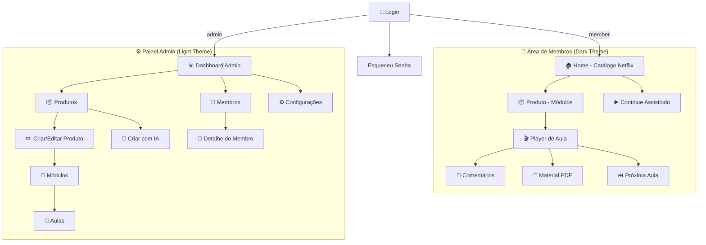
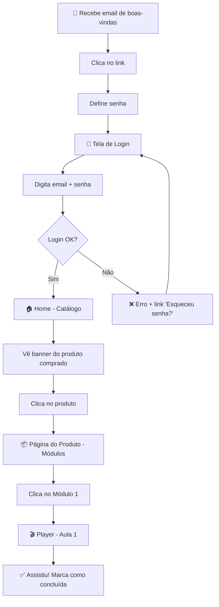
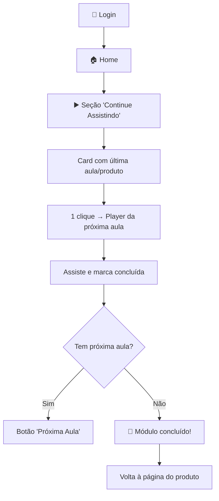
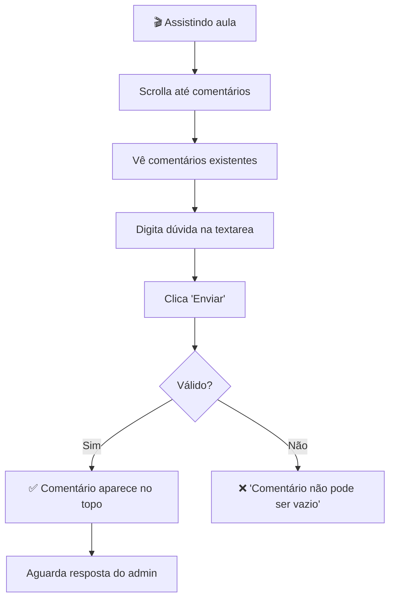
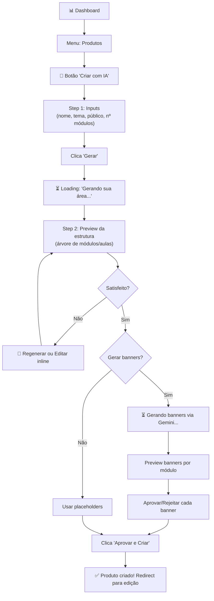
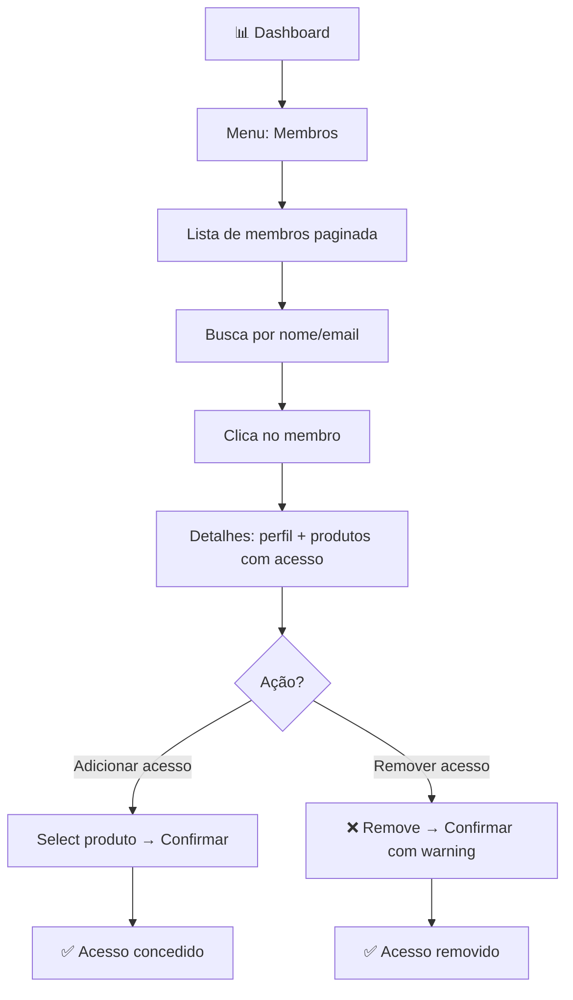

# Memberly UI/UX Specification

> **Versão:** 1.0
> **Data:** 2026-03-11
> **Autor:** Uma (UX Design Expert Agent)
> **Status:** Draft
> **Baseado em:** [PRD v1.0](./prd.md), [Architecture v1.0](./architecture.md), [Brief v1.0](./brief.md)

---

## 1. Introduction

Este documento define os objetivos de experiência do usuário, arquitetura de informação, fluxos de navegação, especificações visuais e sistema de componentes da interface do **Memberly**. Serve como fundação para o design visual e desenvolvimento frontend, garantindo uma experiência coesa e centrada no usuário.

### Overall UX Goals & Principles

#### Target User Personas

**Persona 1: Carla — Admin (Gestora de Produtos)**
- **Idade:** 28-35 anos
- **Perfil:** Profissional de marketing digital da The Scalers, tech-savvy em ferramentas de marketing
- **Contexto:** Cria e gerencia produtos digitais (cursos, mentorias) para experts de saúde
- **Frustração:** Plataformas atuais são lentas, manuais e limitadas para criar áreas de membros
- **Desejo:** Criar uma área de membros completa em minutos, não horas
- **Dispositivo principal:** Desktop (notebook), ocasionalmente mobile para check rápido
- **Skill digital:** Intermediário-avançado — usa bem ferramentas digitais, mas não programa

**Persona 2: Seu João — Membro (Aluno/Cliente)**
- **Idade:** 50-70 anos
- **Perfil:** Brasileiro comum, aposentado ou trabalhador, busca melhorar saúde via cursos online
- **Contexto:** Comprou um curso de saúde do expert, precisa acessar vídeo-aulas
- **Frustração:** Plataformas confusas com muitos botões, texto pequeno, navegação complexa
- **Desejo:** Encontrar e assistir a aula certa sem pedir ajuda ao neto
- **Dispositivo principal:** Smartphone Android (tela 5-6.5"), conexão 4G
- **Skill digital:** Baixo — sabe usar WhatsApp e YouTube, mas se perde em interfaces novas

**Persona 3: Dona Maria — Membro (Aluna/Cliente)**
- **Idade:** 35-50 anos
- **Perfil:** Mulher brasileira, mãe, busca informações práticas de saúde
- **Contexto:** Comprou mentoria de nutrição, quer assistir aulas nos intervalos do dia
- **Frustração:** Não sabe onde clicou, se perdeu na plataforma, não encontra o material PDF
- **Desejo:** Abrir o app, ver "onde parei" e continuar assistindo
- **Dispositivo principal:** Smartphone (Android/iOS), conexão Wi-Fi em casa
- **Skill digital:** Básico-intermediário — usa Instagram e YouTube com facilidade

#### Usability Goals

1. **Zero friction to content:** Membro acessa primeira aula em < 3 cliques após login (Home → Produto → Aula)
2. **Continuidade natural:** Seção "Continue Assistindo" sempre visível na home, levando direto à próxima aula
3. **Auto-explicativo:** Nenhuma tela deve exigir manual ou explicação — ícones + texto, nunca só ícone
4. **Tolerância a erros:** Ações destrutivas (excluir produto, remover acesso) sempre com confirmação clara
5. **Acessibilidade real:** Fontes grandes (mín. 16px), botões grandes (mín. 44px), contraste alto — projetado para público 50+ anos
6. **Admin eficiente:** Wizard de criação via IA reduz tarefas repetitivas; CRUD com feedback instantâneo

#### Design Principles

1. **Simplicidade radical** — Menos é mais. Cada elemento na tela deve ter um propósito claro. Se o Seu João não entenderia, simplifique
2. **Visual-first navigation** — Banners e imagens guiam a navegação, não menus textuais. Netflix, não Wikipedia
3. **Progressive disclosure** — Mostrar apenas o essencial; detalhes sob demanda (expandir descrições, "ver mais")
4. **Feedback imediato** — Toda ação tem resposta visual: loading spinners, toasts de sucesso/erro, transições suaves
5. **Consistência obsessiva** — Mesmo padrão visual em todas as telas. Um botão verde sempre significa "avançar"

### Change Log

| Date | Version | Description | Author |
|------|---------|-------------|--------|
| 2026-03-11 | 1.0 | Criação inicial da especificação UI/UX | Uma (UX Design Expert) |

---

## 2. Information Architecture (IA)

### Site Map / Screen Inventory



### Navigation Structure

**Área de Membros — Primary Navigation:**
- Header fixo minimal: Logo (esquerda) + Nome do membro + Avatar + Logout (direita)
- Sem menu lateral — navegação é feita pelos banners e cards do catálogo
- Breadcrumb simples em telas internas: Home > Produto > Aula

**Painel Admin — Primary Navigation:**
- Sidebar fixa (esquerda): Dashboard, Produtos, Membros, Configurações
- Sidebar collapsa em mobile → hamburger menu
- Breadcrumb detalhado: Dashboard > Produtos > [Nome] > Módulos > [Nome] > Aulas

**Breadcrumb Strategy:**
- Membros: Breadcrumb textual simples, clicável, fonte 14px (discreto mas útil)
- Admin: Breadcrumb completo com todos os níveis, essencial para navegação CRUD

---

## 3. User Flows

### Flow 1: Membro — Primeira Experiência (Compra → Primeira Aula)

**User Goal:** Comprar produto, acessar a plataforma pela primeira vez e assistir a primeira aula
**Entry Points:** Email de boas-vindas com link + credenciais
**Success Criteria:** Membro assiste primeira aula em < 2 minutos após login



**Edge Cases:**
- Email não recebido → orientar verificar spam, oferecer reenvio
- Senha esquecida no primeiro acesso → fluxo de recuperação
- Produto não aparece → webhook falhou, admin verifica manualmente
- Conexão lenta → skeleton loading, player com buffer

---

### Flow 2: Membro — Continuar de Onde Parou

**User Goal:** Retornar à plataforma e continuar assistindo de onde parou
**Entry Points:** Login direto ou bookmark
**Success Criteria:** Em 1 clique na home, chega à próxima aula não assistida



**Edge Cases:**
- Primeiro acesso (sem progresso) → "Continue Assistindo" não aparece, exibe "Meus Cursos"
- Todas as aulas concluídas → card mostra "100% concluído" com checkmark

---

### Flow 3: Membro — Comentar em Aula

**User Goal:** Tirar dúvida sobre o conteúdo da aula
**Entry Points:** Página da aula (abaixo do player)
**Success Criteria:** Comentário publicado e visível instantaneamente



---

### Flow 4: Admin — Criar Área de Membros via IA

**User Goal:** Criar um novo curso completo (produto + módulos + aulas) usando IA
**Entry Points:** Dashboard > Produtos > "Criar com IA"
**Success Criteria:** Área de membros criada com todos os módulos e aulas em < 10 minutos



**Edge Cases:**
- API Claude/Gemini falha → mensagem amigável + botão retry
- Estrutura gerada insatisfatória → edição inline de cada item
- Banner rejeitado → placeholder gradient até upload manual

---

### Flow 5: Admin — Gerenciar Membros e Acessos

**User Goal:** Verificar quem tem acesso a um produto e adicionar/remover manualmente
**Entry Points:** Dashboard > Membros
**Success Criteria:** Visualizar, buscar e gerenciar acessos em < 30 segundos



---

## 4. Wireframes & Key Screen Layouts

**Primary Design Files:** A definir (Figma) — wireframes conceituais abaixo

### Screen 1: Login

**Purpose:** Autenticação de membros e admin

**Key Elements:**
- Logo centralizado no topo
- Campo email (input grande, placeholder "Seu email")
- Campo senha (input grande, eye toggle)
- Botão "Entrar" (full-width, cor primária, 48px height)
- Link "Esqueceu sua senha?" abaixo do botão
- Background: gradiente escuro ou imagem sutil

**Interaction Notes:** Auto-focus no campo email. Enter submete o form. Erro exibido como toast vermelho abaixo do botão. Loading state no botão ("Entrando...").

---

### Screen 2: Home — Catálogo Netflix (Membro)

**Purpose:** Vitrine visual dos produtos do membro com progresso

**Layout:**
```
┌─────────────────────────────────────────────┐
│  Logo                    João ▾   [Sair]    │  ← Header fixo
├─────────────────────────────────────────────┤
│                                             │
│  ┌─────────────────────────────────────┐    │
│  │                                     │    │
│  │        HERO BANNER (16:9)           │    │
│  │   "Curso de Nutrição Funcional"     │    │
│  │        [Continuar Assistindo]       │    │
│  │                                     │    │
│  └─────────────────────────────────────┘    │
│                                             │
│  ▶ Continue Assistindo                      │
│  ┌──────┐ ┌──────┐ ┌──────┐ ┌──────┐      │
│  │ Aula │ │      │ │      │ │      │ →     │
│  │  3   │ │      │ │      │ │      │       │
│  │ ████ │ │      │ │      │ │      │       │
│  └──────┘ └──────┘ └──────┘ └──────┘      │
│                                             │
│  📦 Meus Cursos                             │
│  ┌──────┐ ┌──────┐ ┌──────┐               │
│  │Banner│ │Banner│ │Banner│  →             │
│  │ Curso│ │ Curso│ │ Curso│               │
│  │ 45%  │ │ 12%  │ │ 100%✓│               │
│  └──────┘ └──────┘ └──────┘               │
│                                             │
│  ──────────── Footer ──────────────         │
└─────────────────────────────────────────────┘
```

**Interaction Notes:**
- Hero banner: auto-rotate se múltiplos produtos, pause on hover
- Carrosséis: drag em desktop, swipe em mobile
- Cards: hover mostra leve zoom (scale 1.05) + sombra
- Progresso: barra verde abaixo do card
- "Continue Assistindo" só aparece se há progresso > 0%
- Mobile: cards empilham em grid 2 colunas (1.5 visível para indicar scroll)

---

### Screen 3: Produto — Módulos (Membro)

**Purpose:** Visualizar módulos de um produto com progresso individual

**Layout:**
```
┌─────────────────────────────────────────────┐
│  ← Home    Curso de Nutrição       João ▾   │
├─────────────────────────────────────────────┤
│                                             │
│  ┌─────────────────────────────────────┐    │
│  │      BANNER DO PRODUTO (16:9)       │    │
│  │      "Curso de Nutrição Funcional"  │    │
│  │       12 módulos · 48 aulas         │    │
│  │       [Continuar de onde parei]     │    │
│  └─────────────────────────────────────┘    │
│                                             │
│  Descrição do produto... (truncada, "ver +")│
│                                             │
│  ┌──────────────────────────────────────┐   │
│  │ 📂 Módulo 1: Fundamentos            │   │
│  │ 8 aulas · 3/8 concluídas  ████░░░░  │   │
│  └──────────────────────────────────────┘   │
│  ┌──────────────────────────────────────┐   │
│  │ 📂 Módulo 2: Alimentação            │   │
│  │ 6 aulas · 0/6 concluídas  ░░░░░░░░  │   │
│  └──────────────────────────────────────┘   │
│  ┌──────────────────────────────────────┐   │
│  │ ✅ Módulo 3: Suplementos (completo) │   │
│  │ 5 aulas · 5/5 concluídas  ████████  │   │
│  └──────────────────────────────────────┘   │
│                                             │
└─────────────────────────────────────────────┘
```

**Interaction Notes:**
- "Continuar de onde parei" leva à próxima aula não concluída
- Módulo concluído: badge verde, barra cheia
- Click no módulo expande lista de aulas OU navega para página de aulas
- Mobile: cards full-width, stack vertical

---

### Screen 4: Player de Aula (Membro)

**Purpose:** Assistir vídeo-aula, acessar PDF e comentar

**Layout:**
```
┌─────────────────────────────────────────────┐
│  ← Módulo 1    Aula 3 de 8          João ▾  │
├─────────────────────────────────────────────┤
│                                             │
│  ┌─────────────────────────────────────┐    │
│  │                                     │    │
│  │         VIDEO PLAYER (16:9)         │    │
│  │      YouTube / Panda Video embed    │    │
│  │                                     │    │
│  └─────────────────────────────────────┘    │
│                                             │
│  Aula 3: Como Montar seu Prato Ideal        │
│  Duração: 15 min                            │
│                                             │
│  [✅ Marcar como concluída]                 │
│  [📄 Material da Aula (PDF)]               │
│                                             │
│  [← Aula Anterior]          [Próxima Aula →]│
│                                             │
│  ──── Outras aulas deste módulo ────        │
│  ○ Aula 1: Introdução                      │
│  ○ Aula 2: Macronutrientes                 │
│  ● Aula 3: Como Montar seu Prato ← atual   │
│  ○ Aula 4: Suplementação Básica            │
│                                             │
│  ──── Comentários (12) ────                 │
│  ┌──────────────────────────────────────┐   │
│  │ Escreva sua dúvida...          [Enviar]│  │
│  └──────────────────────────────────────┘   │
│                                             │
│  👤 Maria · há 2h                           │
│  "Posso substituir o arroz por quinoa?"     │
│     ↳ 🔑 Admin · há 1h                     │
│       "Sim, Maria! Quinoa é excelente..."   │
│                                             │
│  👤 Carlos · há 5h                          │
│  "Ótima aula, muito prático!"              │
│                                             │
│  [Carregar mais comentários...]             │
└─────────────────────────────────────────────┘
```

**Interaction Notes:**
- Player responsivo 16:9, ocupa largura total em mobile
- "Marcar como concluída": toggle button, fica verde quando ativo
- PDF: abre em nova aba ou modal com iframe
- Lista de aulas: aula atual destacada (cor primária), concluídas com checkmark
- Comentários: newest first, replies indentados 1 nível, admin com badge
- Mobile: lista de aulas vira accordion colapsável

---

### Screen 5: Dashboard Admin

**Purpose:** Visão geral do sistema com ações rápidas

**Layout:**
```
┌──────────┬──────────────────────────────────┐
│          │  Dashboard              Carla ▾   │
│  📊 Dash │──────────────────────────────────│
│  📦 Prod │                                  │
│  👥 Memb │  ┌──────┐ ┌──────┐ ┌──────┐     │
│  ⚙️ Conf │  │  3   │ │ 847  │ │ 12   │     │
│          │  │Produt│ │Membr │ │Novos │     │
│          │  │ tos  │ │  os  │ │7 dias│     │
│          │  └──────┘ └──────┘ └──────┘     │
│          │                                  │
│          │  Ações Rápidas                   │
│          │  [🤖 Criar Produto com IA]       │
│          │  [📦 Novo Produto Manual]        │
│          │  [👥 Ver Membros]                │
│          │                                  │
│          │  Membros Recentes                │
│          │  ┌────────────────────────────┐  │
│          │  │ Maria · maria@... · há 2h  │  │
│          │  │ João · joao@...  · há 5h   │  │
│          │  │ Ana · ana@...    · há 1d    │  │
│          │  └────────────────────────────┘  │
│          │                                  │
└──────────┴──────────────────────────────────┘
```

---

## 5. Component Library / Design System

### Design System Approach

**Atomic Design (Brad Frost)** com Tailwind CSS v4 e componentes custom React. Sem library de terceiros (shadcn/ui) no MVP para manter controle total e bundle size mínimo. Componentes construídos sob medida para as duas interfaces (dark member + light admin).

### Core Components

#### Atoms

| Component | Variants | States | Usage |
|-----------|----------|--------|-------|
| **Button** | primary, secondary, ghost, danger | default, hover, active, disabled, loading | CTAs, ações, submit |
| **Input** | text, email, password, search, textarea | default, focus, error, disabled | Formulários, busca |
| **Badge** | success, warning, info, admin | default | Status, labels, role indicator |
| **Avatar** | sm, md, lg | default, placeholder | Perfil do membro |
| **ProgressBar** | linear | 0-100% (cor muda com progresso) | Progresso de módulos/produtos |
| **Skeleton** | text, image, card | loading | Loading states |
| **Icon** | Lucide React library | default | Navegação, ações, status |

#### Molecules

| Component | Composed Of | Usage |
|-----------|------------|-------|
| **FormField** | Label + Input + ErrorMessage | Todos os formulários |
| **ProductCard** | Image + Title + ProgressBar | Cards no catálogo Netflix |
| **LessonItem** | Icon + Title + Duration + Status | Lista de aulas |
| **CommentItem** | Avatar + Name + Date + Content + ReplyButton | Comentários |
| **Toast** | Icon + Message + CloseButton | Feedback de ações |
| **ConfirmDialog** | Modal + Title + Message + Buttons | Ações destrutivas |

#### Organisms

| Component | Composed Of | Usage |
|-----------|------------|-------|
| **HeroBanner** | Image + Title + Description + CTA | Topo da home (Netflix) |
| **Carousel** | ProductCard[] + ScrollButtons | Carrosséis horizontais |
| **VideoPlayer** | YouTube/PandaVideo Embed + Controls | Player de aula |
| **CommentSection** | CommentForm + CommentItem[] + LoadMore | Seção de comentários |
| **AdminSidebar** | Logo + NavItem[] + UserInfo | Navegação admin |
| **MemberHeader** | Logo + UserInfo + LogoutButton | Header área de membros |
| **AIWizard** | StepIndicator + Form + Preview + Actions | Wizard de geração IA |

---

## 6. Branding & Style Guide

### Visual Identity

**Brand Guidelines:** A ser definido pela The Scalers. Inicialmente, usar paleta Netflix-inspired para área de membros e tema clean para admin.

### Color Palette

#### Área de Membros (Dark Theme)

| Color Type | Hex Code | CSS Variable | Usage |
|-----------|----------|-------------|-------|
| Background | `#141414` | `--color-bg` | Fundo principal |
| Surface | `#1F1F1F` | `--color-surface` | Cards, modais |
| Surface Elevated | `#2A2A2A` | `--color-surface-elevated` | Cards em hover, dropdowns |
| Primary | `#E50914` | `--color-primary` | CTAs, destaques, progresso |
| Primary Hover | `#B20710` | `--color-primary-hover` | Hover em botões primários |
| Text Primary | `#FFFFFF` | `--color-text` | Texto principal |
| Text Secondary | `#B3B3B3` | `--color-text-secondary` | Texto auxiliar, descrições |
| Text Muted | `#808080` | `--color-text-muted` | Timestamps, metadata |
| Success | `#46D369` | `--color-success` | Concluído, progresso 100% |
| Warning | `#F5C518` | `--color-warning` | Avisos |
| Error | `#E87C03` | `--color-error` | Erros, ações destrutivas |
| Border | `#333333` | `--color-border` | Divisores, bordas sutis |

#### Painel Admin (Light Theme)

| Color Type | Hex Code | CSS Variable | Usage |
|-----------|----------|-------------|-------|
| Background | `#F8FAFC` | `--admin-bg` | Fundo principal |
| Surface | `#FFFFFF` | `--admin-surface` | Cards, painéis |
| Primary | `#2563EB` | `--admin-primary` | CTAs, links, ações |
| Primary Hover | `#1D4ED8` | `--admin-primary-hover` | Hover |
| Text Primary | `#0F172A` | `--admin-text` | Texto principal |
| Text Secondary | `#64748B` | `--admin-text-secondary` | Labels, auxiliar |
| Success | `#16A34A` | `--admin-success` | Confirmações |
| Warning | `#CA8A04` | `--admin-warning` | Alertas |
| Error | `#DC2626` | `--admin-error` | Erros |
| Border | `#E2E8F0` | `--admin-border` | Divisores |
| Sidebar BG | `#1E293B` | `--admin-sidebar-bg` | Sidebar escura |
| Sidebar Text | `#CBD5E1` | `--admin-sidebar-text` | Texto da sidebar |

### Typography

#### Font Families

- **Primary (Sans):** `Inter` — Legibilidade excelente, free, variável, amplamente suportada
- **Fallback:** `system-ui, -apple-system, sans-serif`
- **Monospace:** `JetBrains Mono` — Para código/IDs no admin (uso mínimo)

#### Type Scale

| Element | Size | Weight | Line Height | Usage |
|---------|------|--------|-------------|-------|
| H1 | 32px (2rem) | 700 (Bold) | 1.2 | Títulos de página |
| H2 | 24px (1.5rem) | 600 (Semibold) | 1.3 | Seções, nomes de produto |
| H3 | 20px (1.25rem) | 600 (Semibold) | 1.4 | Subtítulos, nomes de módulo |
| Body | 16px (1rem) | 400 (Regular) | 1.6 | Texto principal, descrições |
| Body Large | 18px (1.125rem) | 400 (Regular) | 1.6 | Body em destaque (mobile) |
| Small | 14px (0.875rem) | 400 (Regular) | 1.5 | Captions, timestamps, metadata |
| Label | 14px (0.875rem) | 500 (Medium) | 1.4 | Labels de formulário |

**Nota para acessibilidade:** Body text nunca menor que 16px. Em mobile, considerar 18px para body. Títulos sempre bold ou semibold para hierarquia visual clara.

### Iconography

**Icon Library:** Lucide React
**Style:** Outline, 24px default, stroke-width 2
**Usage Guidelines:**
- Sempre acompanhar ícone com texto (acessibilidade) exceto em ações óbvias (fechar, expandir)
- Cor do ícone segue cor do texto adjacente
- Ícones em botões: à esquerda do texto, com 8px de gap

### Spacing & Layout

**Grid System:**
- Área de Membros: container com max-width, centrado
  - Mobile: padding 16px lateral
  - Tablet: padding 24px lateral
  - Desktop: max-width 1280px, centrado
- Admin: Sidebar 256px (colapsada 64px) + conteúdo flexível

**Spacing Scale (base 4px):**

| Token | Value | Usage |
|-------|-------|-------|
| `--space-1` | 4px | Gaps mínimos |
| `--space-2` | 8px | Gap entre ícone e texto |
| `--space-3` | 12px | Padding interno de badges |
| `--space-4` | 16px | Padding de cards, gap entre elementos |
| `--space-5` | 20px | Espaço entre seções menores |
| `--space-6` | 24px | Padding de containers |
| `--space-8` | 32px | Espaço entre seções |
| `--space-10` | 40px | Espaço entre blocos maiores |
| `--space-12` | 48px | Margin entre seções de página |
| `--space-16` | 64px | Espaço do layout (sidebar) |

---

## 7. Accessibility Requirements

### Compliance Target

**Standard:** WCAG 2.1 AA (parcial) — foco prático no público-alvo (30-80 anos)

### Key Requirements

**Visual:**
- Contraste mínimo: 4.5:1 para texto normal, 3:1 para texto grande (>= 18px bold ou >= 24px)
- Focus indicators: ring visível (2px solid, cor contrastante) em todos os elementos interativos
- Texto mínimo: 16px body, nunca usar texto menor que 14px

**Interaction:**
- Navegação por teclado: Tab navega entre elementos, Enter/Space ativa, Escape fecha modais
- Screen reader: Landmarks (`<main>`, `<nav>`, `<aside>`), headings hierárquicos (h1→h2→h3)
- Touch targets: mínimo 44x44px em mobile para botões e links

**Content:**
- Alt text: todas as imagens de banner e avatar devem ter alt descritivo
- Headings: estrutura lógica (1 h1 por página, h2 para seções, h3 para sub)
- Forms: todo input tem label visível associado, erros indicados por texto (não só cor)

### Testing Strategy

- Testar com tab navigation em todas as telas
- Verificar contraste com DevTools do browser
- Testar zoom 200% — layout não pode quebrar
- Rodar Lighthouse Accessibility em cada página (target: score >= 90)

---

## 8. Responsiveness Strategy

### Breakpoints

| Breakpoint | Min Width | Max Width | Target Devices |
|-----------|-----------|-----------|----------------|
| Mobile | 320px | 639px | Smartphones (público 30-80 anos, Android) |
| Tablet | 640px | 1023px | Tablets, smartphones landscape |
| Desktop | 1024px | 1279px | Notebooks, desktops |
| Wide | 1280px | - | Monitores grandes |

### Adaptation Patterns

**Layout Changes:**
- Mobile: single column, full-width cards, sem sidebar
- Tablet: 2 colunas para grids de cards, sidebar colapsada
- Desktop: layout completo, sidebar expandida (admin), carrosséis com 4-5 cards

**Navigation Changes:**
- Mobile (Membros): header simplificado, navegação por cards/banners, breadcrumb scrollável
- Mobile (Admin): sidebar → bottom sheet ou hamburger menu, toolbar fixa no topo
- Desktop: sidebar e header completos

**Content Priority:**
- Mobile: hero banner menor (4:3), títulos menores, descrições truncadas com "ver mais"
- Desktop: hero banner full (16:9), descrições completas, mais cards visíveis

**Interaction Changes:**
- Mobile: swipe para carrosséis, tap em vez de hover, botões full-width
- Desktop: hover states, scroll horizontal com botões laterais, tooltips

---

## 9. Animation & Micro-interactions

### Motion Principles

1. **Funcional, não decorativa** — Animações existem para comunicar mudanças de estado, não para impressionar
2. **Rápida e sutil** — Duração máxima 300ms para a maioria das transições
3. **Respeitar `prefers-reduced-motion`** — Desabilitar animações se o usuário preferir
4. **Performance first** — Apenas animar `transform` e `opacity` (GPU-accelerated)

### Key Animations

- **Page Transition:** Fade-in do conteúdo principal (Duration: 200ms, Easing: ease-out)
- **Card Hover:** Scale 1.05 + shadow elevation (Duration: 150ms, Easing: ease-out)
- **Carousel Scroll:** Translate horizontal smooth (Duration: 300ms, Easing: ease-in-out)
- **Modal Open:** Fade-in backdrop + scale-in modal (Duration: 200ms, Easing: ease-out)
- **Toast Notification:** Slide-in from top + auto-dismiss (Duration: 300ms in, 5s display, 200ms out)
- **Progress Bar Update:** Width transition com color change (Duration: 500ms, Easing: ease-in-out)
- **Skeleton Loading:** Shimmer animation em placeholders (Duration: 1.5s, Easing: linear, loop)
- **Button Loading:** Text → spinner transition (Duration: 150ms, Easing: ease)
- **Lesson Complete:** Checkmark scale-in com bounce sutil (Duration: 400ms, Easing: spring)

---

## 10. Performance Considerations

### Performance Goals

- **Page Load (LCP):** < 2.5s em conexão 4G
- **Interaction Response (FID/INP):** < 100ms
- **Animation FPS:** 60fps (apenas transform/opacity)
- **First Load JS:** < 150KB gzipped
- **Cumulative Layout Shift (CLS):** < 0.1

### Design Strategies

- **Skeleton screens** em vez de spinners para loading (evita layout shift)
- **Aspect ratio definido** em containers de imagem/vídeo (previne CLS)
- **Imagens de banner:** WebP com fallback, `srcset` para diferentes tamanhos, lazy loading abaixo do fold
- **Fontes:** `Inter` via `next/font` (auto-hosted, sem FOUT)
- **Video embed:** lazy load do iframe (render apenas quando visível via Intersection Observer)
- **Paginação de comentários:** load 10 iniciais, "carregar mais" sob demanda
- **RSC (React Server Components):** Páginas de catálogo e produto renderizadas no servidor — zero JS para conteúdo estático

---

## 11. Next Steps

### Immediate Actions

1. Stakeholder revisar esta especificação e aprovar paleta de cores, tipografia e layout
2. Criar design tokens formais (`tokens.yaml`) usando `*tokenize` baseado nesta spec
3. Inicializar design system com `*setup` e construir componentes atômicos com `*build`
4. Criar wireframes de alta fidelidade em Figma (opcional — pode ir direto para código com esta spec)
5. Iniciar desenvolvimento do Epic 1 (Foundation & Auth) com `@sm *create-story`

### Design Handoff Checklist

- [x] All user flows documented (5 flows com diagrams)
- [x] Component inventory complete (atoms, molecules, organisms)
- [x] Accessibility requirements defined (WCAG AA parcial)
- [x] Responsive strategy clear (4 breakpoints, adaptation patterns)
- [x] Brand guidelines incorporated (color palette, typography, spacing)
- [x] Performance goals established (LCP, FID, CLS targets)

---

*Documento gerado por Uma (UX Design Expert Agent) — Synkra AIOX v5.0.3*
*— Uma, desenhando com empatia 💝*
